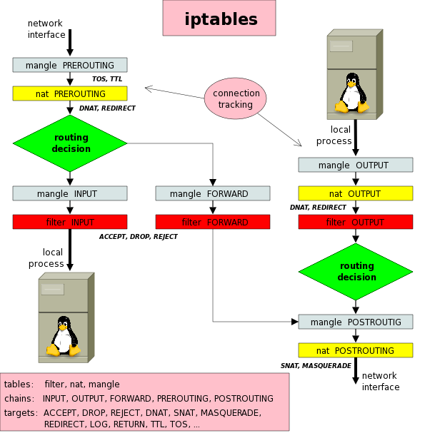

# iptables
## INFO

Iptables, ip6tables are used to maintain packet filter rules in the Linux kernel.  
*Note:iptables is Not Service.iptables is Mechanism You can work with net Filter in Kernel*




1- The First thing to do is to check if Iptables is running on the system. Iptables is running as a kernel module so it can’t be seen as one of the normal processes.

```
lsmod|grep iptable
```


## Tables and Chains

**1-Table = Filter < Chains = [ OUTPUT, INPUT, FORWARD ]**  
**2-Table = Nat < Chains = [ OUTPUT, PREROUTING, POSTROUTING ]**  
**3-Table = Mangle < Chains = [ INPUT, OUTPUT, FORWARD, PREROUTING, POSTROUTING ]**

## Most Important Switches

**-A => append**  
**-I => Insert**  
**-D => DELETE**  
**-F => Flush**  
**-R => Replace**  
**-P => Policy**  
**-i -> input bound**  
**-o -> output bound**  
**-N -> create New chain**  
**-X -> Delete chain**  
*Note : in Interface switch you can use any for all Interfaces*  
**-s or --source -> source ip**  
**-d or --destination -> destination ip**  
**-p -> protocol**  
**-m -> module**  
**--sport -> source port**  
**--dport -> destination port**

### Basic Examples

```
sudo iptables -A INPUT -i enps0 -p tcp --source 192.168.1.105 --dport 80 -j DROP
```
```
sudo iptables -A INPUT -i enps0 -p tcp --source 92.168.1.102 --sport 80 --destination 192.168.1.102 --dport 80 -j DROP
```

### Basic Nat Exapmle

```
iptables -t nat -A PREROUTING -i enp1s0 -p tcp --dport 80 -j DNAT --to-destination 192.168.1.3:8080 
```
-t -> nat Operate on the nat table...  
-A -> PREROUTING... by appending the following rule to its PREROUTING chain.  
-i -> eth1Match packets coming in on the eth1 network interface...  
-p tcp ->  that use the tcp (TCP/IP) protocol  
--dport 80 -> intended for local port 80.  
j DNAT -> Jump to the DNAT target...  
--to-destination -> change the destination address to 192.168.1.3 and destination port to 8080.


## Important Modules

### comment

```
sudo iptables -A INPUT -i enp1s0 -p icmp -m comment --comment "ADMIN:koosha"
```

### connection Limit

```
sudo iptables -A INPUT -i enp1s0 -p icmp -m connlimit --connlimit-above 2 -j DROP
```

### Mac Address

```
sudo iptales -A INPUT -i enp1s0 -p icmp -m mac --mac-source 2C:5E:55:6D:7E:66 -jDROP
```

### TTL

```
sudo iptables -I INPUT -p icmp -m ttl --ttl-gt 128 -j DROP
```  
```
sudo iptables -I INPUT -p icmp -m ttl --ttl-lt 128 -j DROP
```  
```
sudo iptables -I INPUT -p icmp -m ttl --ttl-eq 128 -j DROP
```

### connection Track and State

```
sudo iptables -A OUTPUT -o enps0 -p tcp --sport 22 -j ACCEPT
```

```
sudo iptables -A INPUT -i enp1s0 -p tcp --dport 22 -m state --state NEW,ESTABLISHED -j ACCEPT
```

### Limit

```
sudo iptables -A input -i enp1s0 -p tcp --dport 80 -m limit --;imit 50/minute
```  
```
sudo iptables -A INPUT -i enp1s0 -p tcp --dport 80 -m limit --limit 50/minutes --limit-burst 100
```


## Important Examples
### Nework Traffic Load Balancing

```
 sudo iptables -t nat -A PREROUTING  -p tcp --dport 443 -m state --state NEW -m statistic --mode nth --every 3 --packet 0 -j DNAT --to-destination 192.168.1.101:443
```
```
iptables -t nat -A PREROUTING -p tcp --dport 443 -m state --state NEW -m statistic --mode nth --every 3 --packet 1 -j DNAT --to-destination 192.168.1.102:443
```
```
iptables -t nat -A PREROUTING  -p tcp --dport 443 -m state --state NEW -m statistic --mode nth --every 3 --packet 2 -j DNAT --to-destination 192.168.1.103:443
```


### prevent traceroute network

```
sudo iptables -t raw -A PREROUTING -p udp --dport 33434:3534 -j DROP
```
```
sudo iptables -t raw -A PREROUTING -p icmp --icmp-type 8 -l DROP
```

### Drop Invalid Packet

```
sudo iptables -t mangle -A PREROUTING -m conntrack --ctstate INVALID -j DROP
```


